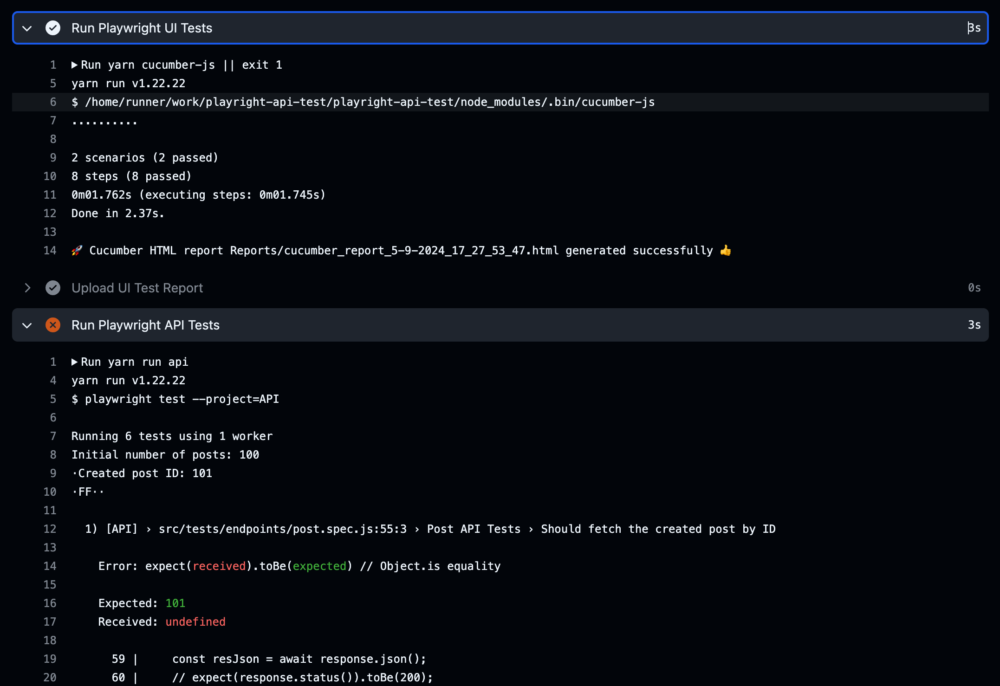
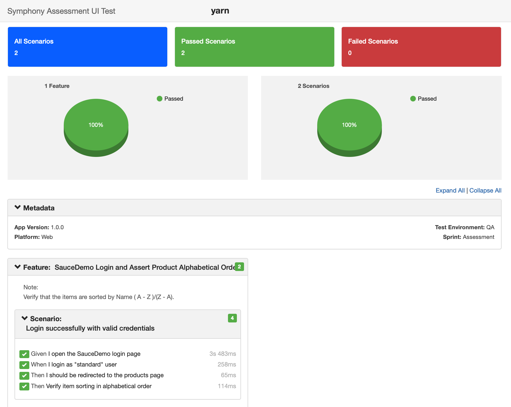

# Playwright UI/API Test with Dynamic Environment Variables

This is an assessment project on using Playwright for API testing, including dynamically storing response data as environment variables in a `.env` file.

## Prerequisites

- Node.js (v18 or higher)
- Playwright
- `dotenv` package

## Installation

1. Clone this repository:

   ```bash
   git clone https://github.com/ebbimola/playright-api-test.git
   cd playwright-api-test

   pnpm install or yarn install
   ```

## Project Structure

```bash
playwright-api-test/
├── README.md
├── Reports
│   ├── api_report.json
│   ├── cucumber_report.json
│   └── cucumber_report_5-9-2024 13h23m12_219.html
├── cucumber.json
├── htmlReport.js
├── package.json
├── playwright.config.js
├── pnpm-lock.yaml
├── screenshots
├── src
│   ├── config
│   │   └── pages.json
│   ├── features
│   │   ├── steps-definitions
│   │   │   └── verify-ascending-descending-order.steps.js
│   │   └── verify-ascending-descending-order.feature
│   ├── tests
│   │   └── endpoints
│   │       └── post.spec.js
│   └── utils
│       ├── actions.js
│       ├── env.js
│       └── setup.js
└── tsconfig.json
```
## Running Test

```bash
- API Test Run
  pnpm api or yarn api
- Cucumber-UI Test Run
  pnpm ui or yarn ui
```
## Utility Function For Dynamic Variable Management
```bash
loadEnv()
Loads existing environment variables from the .env file into process.env.

updateEnv(key, value)
Updates or adds a key-value pair in the .env file.

function loadEnv() {
  const envFilePath = path.resolve(__dirname, "../../.env");
  if (fs.existsSync(envFilePath)) {
    dotenv.config({ path: envFilePath });
  }
}
function updateEnv(key, value) {
  const envFilePath = path.resolve(__dirname, "../../.env");

  const envVariables = fs.existsSync(envFilePath)
    ? dotenv.parse(fs.readFileSync(envFilePath))
    : {};

  envVariables[key] = value;

  const envFileContent = Object.entries(envVariables)
    .map(([k, v]) => `${k}=${v}`)
    .join("\n");

  fs.writeFileSync(envFilePath, envFileContent, { encoding: "utf8" });
}

module.exports = {
  loadEnv,
  updateEnv,
};
```
## Endpoint Test

```bash
  test("Should create a new post", async ({ request }) => {
    const data = JSON.stringify({
      title: "Assessment",
      body: "Symphony",
      userId: 1,
    });
    const response = await request.post("/posts", {
      data: data,
    });
    expect(response.status()).toBe(201);
    createdPostId = await response.json();
    createdPostId = createdPostId.id;
    updateEnv("POSTS_ID", createdPostId.toString());
    process.env.POST_ID = parseInt(createdPostId);
    expect(createdPostId).toBeDefined();
    console.log(`Created post ID: ${createdPostId}`);
  });
  ```

## Cucumber Test

```bash
  Feature: SauceDemo Login and Assert Product Alphabetical Order
  Note: 
  Verify that the items are sorted by Name ( A - Z )/(Z - A).

  Background: Login to SauceDemo
    Given I open the SauceDemo login page
    When I login as "standard" user

  Scenario: Login successfully with valid credentials
    Then I should be redirected to the products page
    Then Verify item sorting in alphabetical order

  Scenario: Verify Reverse/Descending Order
    Then I should be redirected to the products page
    Then Verify item sorting in reverse alphabetical order
    
  /**
  * Initialize and return a new page instance.
  * @returns {Promise<Page>} The Playwright page instance.
  */
  async function setup() {
    browser = await chromium.launch();
    context = await browser.newContext();
    page = await context.newPage();
    return page;
  }

  /**
  * Closes the browser.
  * @async
  * @function close
  * @returns {Promise<void>}
  */
  async function close() {
    await browser.close();
  }
```

## Github Actions

```bash
      - name: Run Playwright API Tests
        run: pnpm api

      - uses: actions/upload-artifact@v4
        if: always()
        with:
          name: API Report
          path: Report/
          retention-days: 30

      - name: Run Playwright UI Tests
        run: |
          yarn cucumber-js || exit 1
          node ./htmlReport.js || exit 1

      - name: Upload UI Test Report
        uses: actions/upload-artifact@v4
        if: always()
        with:
          name: UI Report
          path: Reports/
          retention-days: 30
```
(https://github.com/ebbimola/playright-api-test/actions/runs/10725237578/job/29742621135)

## Sample Report
